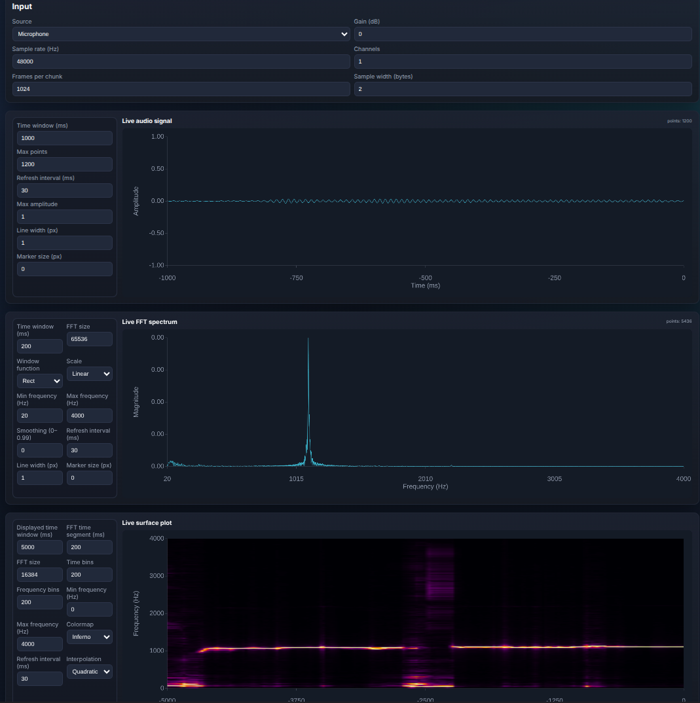

# Voice Analyzer

Web app for streaming live audio, processing it, and visualizing it with minimal latency.



## Description
- Stream live audio in the frontend from mic
- Perform FFT directly in the frontend to minimize latency
- Plot three live plots:
  - Figure 1: Live audio signal
  - Figure 2: Live FFT spectrum
  - Figure 3: Live surface FFT vs time
- All params live in `config.yaml` as defaults

## How to run:
1. Build docker image and run via:
    ```bash
    $ docker compose up --build
    ```
2. Open http://localhost:4173 in the browser